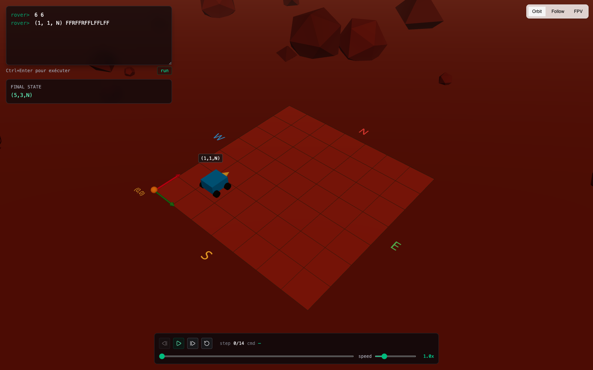

# Spottt Mars Rover

[](https://rover.geoquizz.io)

Simulateur de rover martien sur une grille, rendu 3D WebGL, timeline de replay avec pause, vitesse variable et retour en arrière ou avance manuelle.

Arbitrages produit détaillés dans [`docs/decisions.md`](docs/decisions.md). Workflow IA résumé plus bas.

---

## Run

Prérequis : Node ≥ 20, pnpm ≥ 10.

```bash
pnpm install           # dépendances
pnpm dev               # serveur de dev (http://localhost:3001)
pnpm build             # build prod
pnpm test              # tests
pnpm check-types       # typecheck
pnpm check             # lint + format
pnpm fix               # autofix
```

Pour cibler un seul package : `pnpm -F @spottt/core test`.

### Utilisation



Un scénario est écrit dans le terminal en haut à gauche (format : `m n` puis `(x, y, O) CMDS`). `Ctrl+Enter` pour l'exécuter — le scénario est alors sérialisé dans l'URL et partageable par copier-coller. La timeline en bas permet replay, pause, avance/retour manuels et vitesse variable. Bouton caméra à droite pour changer d'angle.

---

## Workflow IA

Tout le développement est piloté avec **Claude Code**, orchestré via **Conductor** (jusqu'à 5 workspaces en parallèle). Le travail est découpé en amont sous forme d'**issues GitHub** (#2 → #15) de 10 à 25 minutes chacune, avec un scope de fichiers explicite par ticket. Chaque ticket donne une branche `fsioni/<nom>`, une PR atomique, un merge.

Ce qui a bien marché : **le découpage ticket → workspace → PR**. L'agent reste concentré sur un périmètre court, les PR sont lisibles, et les workspaces parallèles évitent les conflits.

Ce qui aurait pu aller mieux : **vérifier les skills packs avant de coder**. J'ai réalisé après coup qu'il existe [`EnzeD/r3f-skills`](https://github.com/EnzeD/r3f-skills) pour React Three Fiber, qui aurait pu donner les bonnes pratiques dès le départ.

Je n'ai pas exporté un historique de prompts propre — le travail est réparti sur plusieurs workspaces et plusieurs conversations par ticket. Les messages de commit et les PR décrivent chaque étape de manière traçable.

---

## Arbitrage

Deux axes retenus : le **contrôle du temps** sur le replay (pause, avance et retour pas à pas, vitesse variable) et la **qualité du parser** (erreurs nommées avec numéro de ligne, refus de toute session contenant la moindre erreur). Les deux se tiennent : le contrôle du temps ne marche que si on rejoue le scénario depuis le début à chaque changement de position, ce qui force à bien séparer la logique (dans `packages/core`) du rendu (dans `apps/web`).

Écartés volontairement : la planète sphérique (coût géométrique), les multi-rovers parallèles (extension triviale, non nécessaire pour démontrer l'axe choisi), les obstacles, les textures / skybox / post-process (remplacés par un terrain low poly fait main : roches, dunes, axes cardinaux colorés), et la persistence serveur (tout en mémoire, partage par URL).

Pour une **démo investisseur**, je basculerais sur le visuel (skybox, textures, post-process, caméra drone pendant le replay). Pour une **mise en prod demain**, il manquerait du property-based testing sur le parser (fast-check), un error boundary React avec remontée Sentry, et quelques tests Playwright sur le chemin terminal → URL → état final affiché.

---

## Architecture

```
/
├── packages/
│   ├── core/             # logique du rover, sans dépendance à React ni Three
│   │   └── src/
│   │       ├── types.ts          # types de base (grille, rover, commande)
│   │       ├── errors.ts         # catégories d'erreurs du parser
│   │       ├── parser.ts         # lit un scénario texte, renvoie scénario ou erreurs
│   │       ├── engine.ts         # exécute un scénario et renvoie la trace pas à pas
│   │       └── *.test.ts         # tests + bench
│   ├── ui/               # boutons et primitives partagés
│   └── config/           # configuration TypeScript partagée
└── apps/
    └── web/              # l'app React qui affiche le rover en 3D
        └── src/
            ├── routes/                   # pages (une seule : index)
            ├── lib/
            │   ├── scenario-search.ts    # lit le scénario depuis l'URL
            │   └── replay-clock.ts       # horloge du replay (play, pause, vitesse, position)
            └── components/
                ├── controls/timeline.tsx # barre de timeline et contrôles
                └── scene/
                    ├── scene.tsx         # scène 3D
                    ├── rover.tsx         # rover animé (mouvement et rotation fluides)
                    ├── rover-label.tsx   # étiquette avec la position au-dessus du rover
                    ├── ghost-trail.tsx   # trace qui s'efface derrière
                    ├── camera-controller.tsx  # 3 modes de caméra
                    ├── terrain.tsx       # sol, grille, axes cardinaux
                    └── decor.tsx         # roches et dunes low poly
```

Tout ce qui est logique du rover (parser, exécution des commandes, gestion du LOST, trace pas à pas) vit dans `packages/core`, sans rien connaître de React ou de Three.js. Ça se teste en Node pur, ça se bench directement, et si demain je voulais brancher une CLI ou un petit serveur de scoring, je réutiliserais le paquet tel quel.

L'app `apps/web` importe ce paquet via `@spottt/core` (lien de workspace pnpm, pas d'étape de build intermédiaire en dev) et s'occupe uniquement de l'affichage. La séparation est stricte : `execute(scenario)` produit une liste de snapshots pas à pas ; la timeline pointe vers un snapshot, la scène 3D affiche l'état correspondant et interpole entre deux. Le rendu ne connaît pas les commandes, il lit juste « où est le rover à ce moment ».

L'URL est la source de vérité : le scénario est stocké dans un paramètre d'URL validé par Zod (TanStack Router). Le terminal écrit dans l'URL, le reste de l'app la lit. Partager un scénario = copier-coller l'URL.

Côté outillage, la CI tourne en 4 jobs parallèles (lint, typecheck, test, build) sur GitHub Actions, et on utilise Biome / Ultracite comme lint et format unique — pas d'ESLint + Prettier à maintenir en parallèle.

Couverture de tests Vitest sur le parser, l'engine, un bench 10k commandes, l'horloge de replay et la validation du paramètre d'URL.

---

## Limitations connues

- **Un seul rover par scénario.** Si l'entrée en contient plusieurs, elle est refusée.
- **Terrain plat et trivial.** Pas de sphère, pas d'obstacles, pas de relief.
- **Pas de tests end-to-end.** Le parser, l'engine et la logique de replay sont couverts unitairement, mais pas le chemin complet depuis le terminal jusqu'à l'écran.
